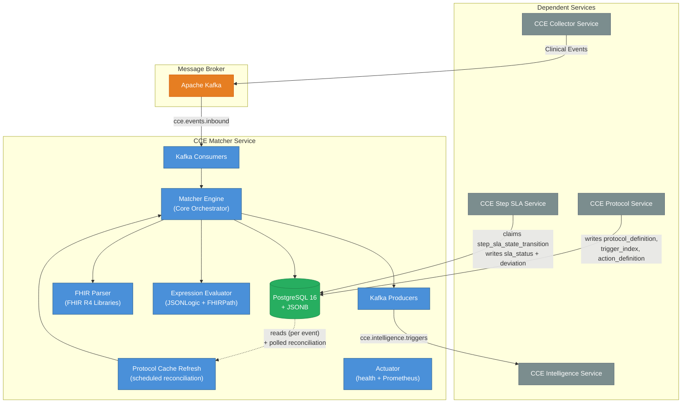
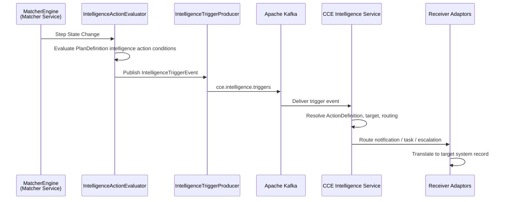
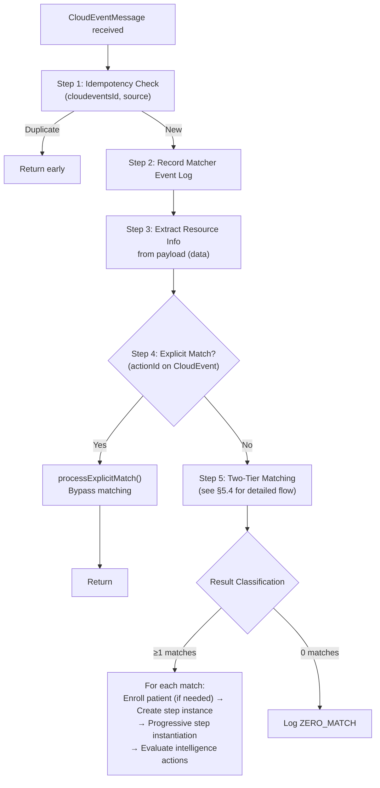
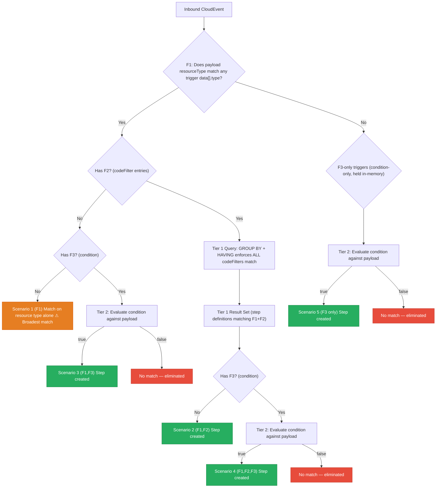
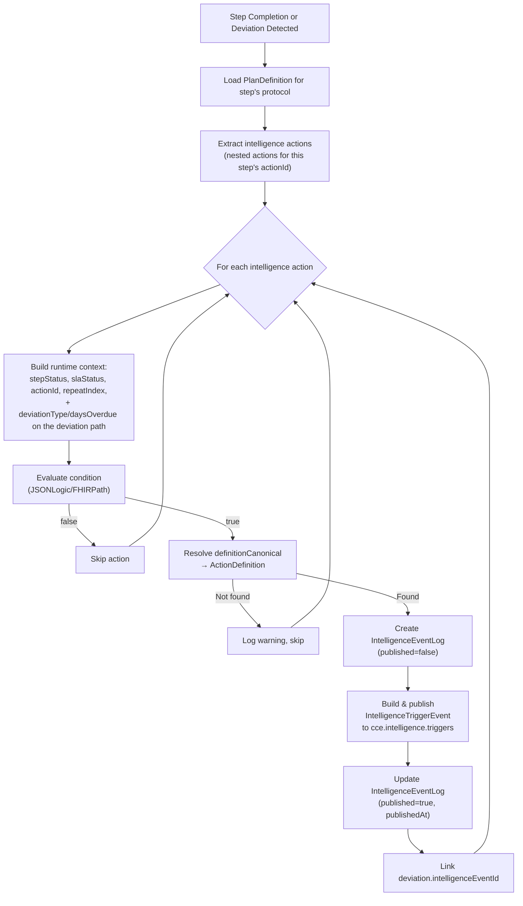
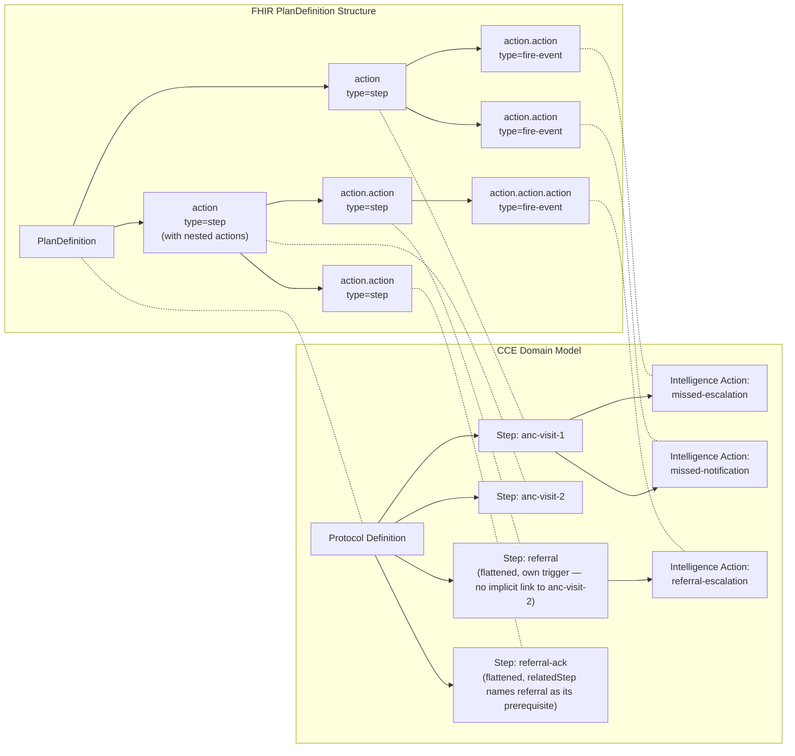
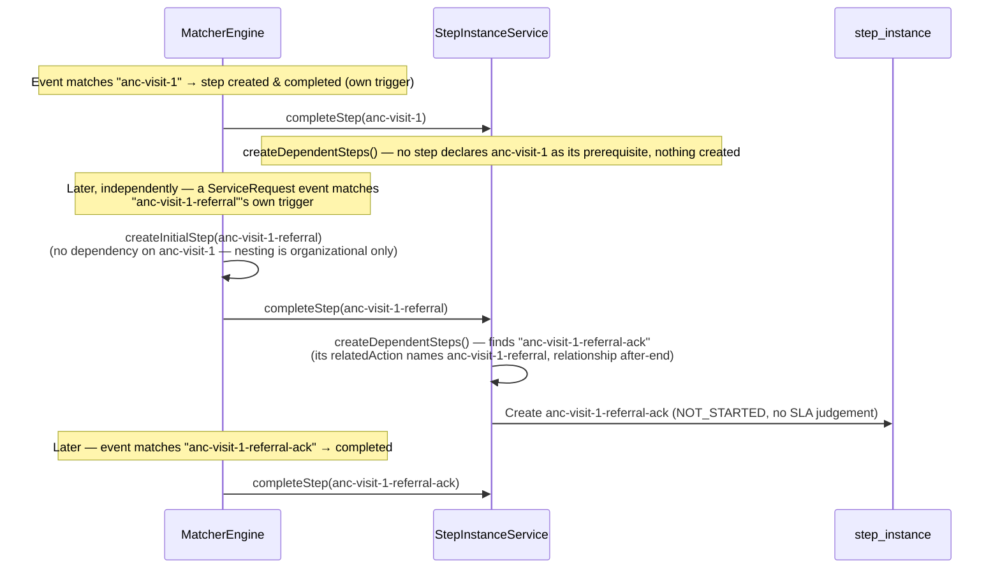

# Architecture & Design

## 1. System Context

The **CCE Matcher Service** is a core microservice within the **CCE** platform. It tracks patient adherence to clinical protocols defined as FHIR R4 `PlanDefinition` resources — consuming clinical events, matching them against protocol steps, detecting deviations, evaluating intelligence actions, and publishing intelligence trigger events to downstream services.

This section places Matcher among its neighbours. *Why* the platform is split across these services, and the topology as a whole, is covered once in
[`cce-common-util` → architecture-overview.md](../../cce-common-util/docs/architecture-overview.md).



**No REST API.** This service is driven entirely by Kafka. The only HTTP it serves is `/actuator`
(health probes and Prometheus scraping) — there is no application endpoint and therefore no API Gateway
route to it.

**This service does NOT handle:** event collection/ingestion (CCE Collector Service), time-based SLA transitions and their deviations (CCE Step SLA Service), analytics, alerting (CCE Intelligence Service), or protocol and action-definition management (CCE Protocol Service, which owns the `protocol_definition`, `trigger_index` and `action_definition` tables Matcher reads).

### 1.1 SLA Transition Evaluation Contract

Time-based `sla_status` transitions are owned by the **CCE Step SLA Service**. Matcher's role is to
*schedule* them: when it creates a step it writes one
[`step_sla_state_transition`](../../cce-common-util/docs/data-dictionary.md#7-step_sla_state_transition)
row per threshold, in the same transaction, so a step never exists without its schedule.

Everything after that — deciding which rows are due, applying the status change, recording the
deviation — happens in the Step SLA Service. There is **no Kafka hop and no HTTP call** between the
two: they meet on one table in the shared database, with one writer per column.

**The invariant that matters here:** Matcher owns what an inbound event establishes — that the work
happened, and when — and the Step SLA Service owns every judgement of timeliness made from it. The two
never write the same column. Concretely, Matcher writes `step_status` and `completed_at` and never
`sla_status`; it inserts the transition rows and never touches one again. Compliance reads that
`completed_at` and settles the SLA from it, either when a threshold falls due or on its next sweep after
a completion.

`ORDER_VIOLATION` deviations stay in this service, because they are detected from the event itself at
completion rather than from a deadline passing.

The full contract — the two reasons a row is claimable, what the applier does when an event arrived
before its deadline, retry and backoff — is documented once, on the side that implements it:

- `cce-common-util` → [Architecture Overview §5](../../cce-common-util/docs/architecture-overview.md#5-sla-transition-contract) — the contract
- `cce-step-sla-service` → [Architecture §3–4](../../cce-step-sla-service/docs/architecture-overview.md#3-the-claim-protocol) — the implementation
- Column-by-column ownership: `cce-common-util` → [Data Dictionary §3](../../cce-common-util/docs/data-dictionary.md#3-ownership)

### 1.2 Intelligence Service Contract

The **CCE Intelligence Service** is the downstream consumer of intelligence trigger events published by the Matcher Service. It receives structured trigger events via Kafka, resolves delivery targets, and routes notifications, tasks, and escalations to the appropriate **Receiver Adaptors**. Communication is **exclusively via Kafka** — there are no direct service-to-service HTTP calls.



#### Message Contract

The Matcher Service publishes `IntelligenceTriggerEvent` messages to `cce.intelligence.triggers`. Each message contains all the context the Intelligence Service needs to route and deliver the action:

| Field | Purpose | Source |
|---|---|---|
| `id` | Unique event identifier | Generated UUID |
| `subject` | Patient identifier | Protocol instance subject |
| `actionId` | PlanDefinition step that triggered the intelligence action | Step instance's action ID |
| `protocolCanonical` | Protocol `url\|version` | Protocol definition canonical |
| `facilityId` | Facility where the event occurred | CloudEvent extension attribute |
| `metadata` | Additional context (due dates, timing, severity) | Step and deviation runtime state |
| `eventPayload` | Original FHIR resource payload from the inbound CloudEvent | CloudEvent `data` (null for the deviation path) |

See [Kafka Events §5.3](kafka-events.md#52-intelligencetriggerevent-outbound--cceintelligencetriggers) for the full message schema.

#### Ownership & Boundaries

| Aspect | Owner | Details |
|---|---|---|
| **Intelligence action evaluation** | Matcher Service | Evaluates PlanDefinition intelligence action conditions, resolves `definitionCanonical` to `ActionDefinition` |
| **Trigger event publishing** | Matcher Service | Publishes `IntelligenceTriggerEvent` to Kafka; creates `intelligence_event_log` record (published=false → true) |
| **`action_definition` table** | Matcher Service | Schema, writes, Flyway migrations — stores `ActivityDefinition` resources referenced by intelligence actions |
| **`intelligence_event_log` table** | Matcher Service | Tracks each intelligence action execution with evaluation context and Kafka event payload |
| **Event consumption & routing** | Intelligence Service | Consumes from `cce.intelligence.triggers`, resolves delivery targets, routes to Receiver Adaptors |
| **Notification/task delivery** | Intelligence Service + Receiver Adaptors | Translates intelligence events into system-specific records (SMS, in-app alerts, EMR tasks, escalation workflows) |
| **Kafka topic** | Shared | `cce.intelligence.triggers` — Matcher produces, Intelligence consumes |

> **Key invariant:** The Matcher Service is the **sole publisher** to `cce.intelligence.triggers`. It evaluates conditions and publishes structured trigger events but has no knowledge of how they are delivered. The Intelligence Service is the sole consumer — it owns the routing logic, adaptor selection, and delivery confirmation. This separation ensures the Matcher Service remains **delivery-agnostic** and the Intelligence Service can evolve its routing independently.

## 2. Technology Stack

| Category | Technology | Version | Purpose |
|---|---|---|---|
| **Runtime** | Java | 21 LTS | Language runtime |
| **Framework** | Spring Boot | 3.4.2 | Application framework |
| **Persistence** | Spring Data JPA / Hibernate | 6.x | ORM and data access |
| **Database** | PostgreSQL | 16 | JSONB, GIN indexes |
| **Migration** | Flyway | 10.x | Schema version management |
| **JSONB Mapping** | Hibernate 6 `@JdbcTypeCode(SqlTypes.JSON)` | 6.x | Native JPA ↔ PostgreSQL JSONB |
| **Messaging** | Spring Kafka | 3.x | Event-driven messaging |
| **FHIR** | HAPI FHIR (R4 structures) | 7.6.0 | FHIR R4 PlanDefinition parsing; FHIR spec version 4.0.1 |
| **Expression** | Apache Johnzon JsonLogic | 2.0.2 | Tier 2 conditional evaluation (JSONLogic) |
| **Expression** | HAPI FHIRPath | 7.6.0 | Tier 2 conditional evaluation (FHIRPath) |
| **Metrics** | Micrometer + Prometheus | 1.x | Application metrics |
| **Testing** | JUnit 5 + Mockito | 5.x / 5.x | Unit testing with mocked dependencies |
| **Integration testing** | EmbeddedKafka + H2 (PostgreSQL mode) | — | In-process broker and database; no Docker required |

## 3. Module & Package Structure

The service is one half of a **composite Gradle build**. Shared vocabulary — entities, enums, Kafka
contracts and the FHIR layer — lives in a sibling repository, `cce-common-util`, so that this service and
the CCE Step SLA Service cannot drift on the tables and messages they both touch.

```
cce-matcher-service/                       ← this repo
└── settings.gradle: includeBuild '../cce-common-util'
```

`includeBuild` rather than a published artifact: the two repos sit side by side, so a change in
`cce-common-util` is picked up on the next build with no publish step and no version bump. **The sibling
repo must be checked out next to this one or the build fails** — see
[Developer Setup](developer-setup.md).

### 3.1 What comes from `cce-common-util`

Anything more than one service must agree on: the shared entities and repositories, the status enums,
the Kafka wire contracts (`CloudEventMessage`, `IntelligenceTriggerEvent`), the FHIR layer
(`PlanDefinitionParser`, `ParsedProtocolCache`, `FhirExpressionEvaluator`) and the shared services
(`DeviationRecorder`, `StateTransitionHistoryWriter`, `IntelligenceActionEvaluator`, `ActionDefinitionResolver`,
`SlaThresholdReader`).

That inventory is not restated here — see
[`cce-common-util` → library-reference.md](../../cce-common-util/docs/library-reference.md) for the
package-by-package reference, and
[data-dictionary.md](../../cce-common-util/docs/data-dictionary.md) for the nine shared tables.

`SlaThresholdReader` is worth singling out: Matcher *writes* a step's SLA schedule and Compliance *reads*
it, so how those rows are interpreted is shared code rather than duplicated on both sides.

### 3.2 What stays here (`org.openphc.cce.matcher`)

Matching is this service's job and nothing else's, so it does not move:

```
org.openphc.cce.matcher
├── MatcherServiceApplication.java   # @SpringBootApplication(scanBasePackages = "org.openphc.cce")
│                                    #   + @EntityScan / @EnableJpaRepositories("org.openphc.cce")
│                                    #   + @EnableScheduling
├── config/                          # KafkaConfig (consumer/producer factories, topics),
│                                    #   ObservabilityConfig (repository-backed gauges)
├── domain/
│   ├── entity/                      # Matcher-owned tables only: MatcherEventLog, Facility,
│   │                                #   ProtocolInstanceHistory, StepInstanceHistory
│   └── repository/                  # Those, plus ProtocolDefinitionRepository (fingerprint query)
│                                    #   and TriggerIndexRepository (the Tier 1 match)
├── kafka/consumer/                  # InboundEventConsumer — the only consumer
└── service/                         # MatcherEngine and the matching pipeline:
                                     #   EventCodesExtractor (codes; the resource type
                                     #   comes from common-util's ResourceTypeDetector),
                                     #   TriggerMatchingService,
                                     #   StepInstanceService,
                                     #   StepSlaScheduleService, ProtocolDefinitionService,
                                     #   ProtocolInstanceService, MatcherEventLogService,
                                     #   StateTransitionHistoryWriter, FacilityService
                                     #   + records CodePathTriple, ConditionOnlyTrigger, MatchedStep
```

### 3.3 Bean discovery across the two packages

`org.openphc.cce.common` is not under this application class's default scan root, so all three scans are
widened explicitly on `MatcherServiceApplication`:

| Annotation | Why it is needed |
|---|---|
| `@SpringBootApplication(scanBasePackages = "org.openphc.cce")` | Picks up the `@Component`/`@Service` beans `cce-common-util` contributes |
| `@EntityScan("org.openphc.cce")` | `@Entity` types are not found by component scanning |
| `@EnableJpaRepositories("org.openphc.cce")` | Nor are Spring Data repository interfaces |

> One consequence worth knowing: `common.exception.GlobalExceptionHandler` is a `@ControllerAdvice` and is
> therefore registered here too. It is inert — this service has no controllers for it to advise — but it
> is on the context.

There is no `web/` package in this repo: the service exposes no REST API of its own.

## 4. Core Pipeline — MatcherEngine

The `MatcherEngine` is the central orchestrator. All inbound event processing flows through it:



### 4.1 Resource Extraction

Resource metadata is extracted from the CloudEvent **payload** (`data`), never from the envelope:

| Field | Extraction Paths |
|---|---|
| `resourceType` | `data.resourceType` (e.g., `"Observation"`, `"Encounter"`) |
| `allCodes` | `data.code.coding[*]`, `data.class.coding[*]`, `data.serviceType.coding[*]`, `data.clinicalStatus.coding[*]`, `data.verificationStatus.coding[*]`, `data.type[*].coding[*]`, `data.category[*].coding[*]`, `data.identifier[*]` (system+value), `data.status` |

**These nine paths are the whole matchable surface**, and they are one list:
[`TriggerPath`](../../cce-common-util/src/main/java/org/openphc/cce/common/fhir/TriggerPath.java) in
cce-common-util. `EventCodesExtractor` drives its extraction from that enum, and the Protocol Service
validates every `codeFilter.path` against it at load, so a path reaches both sides in one change or
neither. The `resourceType` row above is read by
[`ResourceTypeDetector`](../../cce-common-util/src/main/java/org/openphc/cce/common/fhir/ResourceTypeDetector.java),
also in cce-common-util, because the Collector Service needs the same reading of the same payload.

It used to be two lists, which is how `serviceType` came to be indexed by the parser and read by
nothing: a path in the protocol's list but missing from the extractor's is indexed and then never
matched, and because Tier 1 requires *every* codeFilter of an action to match, one such path disables
that action's trigger outright rather than loosening it. The reference ANC protocol's enrolment trigger
was dead for exactly that reason.

### 4.2 Clinical Event Time Extraction

When an inbound event **completes** a step, the completion is attributed to the **clinical occurrence time** — when the act actually happened — rather than the time the event reached the service. This keeps a completed step's `completed_at`, its `sla_status`, and the calculated due/missed dates of any **dependent steps** accurate even when events arrive late (offline sync, batch upload, retries, DLQ replay).

`ClinicalEventTimeExtractor` derives this time from the FHIR payload using a resource-type → clinical-time-field table, handling FHIR's polymorphic `[x]` choice types by probing concrete field names in priority order. It lives in [cce-common-util](../../cce-common-util/docs/library-reference.md#clinicaleventtimeextractor) because the Collector Service stamps `inbound_event_log.event_time` from the same reading: while the two services held separate copies, an `Encounter` carrying both bounds was recorded there at `period.end` and judged here at `period.start`, so the audit trail and the SLA clock disagreed about when the visit happened.

| Resource type | Clinical-time fields (first match wins) |
|---|---|
| `Observation` | `effectiveDateTime` → `effectiveInstant` → `effectivePeriod.start` → `issued` → `effectivePeriod.end` |
| `Encounter` | `period.start` → `period.end` |
| `Procedure` | `performedDateTime` → `performedPeriod.start` → `performedPeriod.end` |
| `Immunization` | `occurrenceDateTime` |
| `MedicationAdministration` | `effectiveDateTime` → `effectivePeriod.start` → `effectivePeriod.end` |
| `MedicationDispense` | `whenHandedOver` → `whenPrepared` |
| `MedicationRequest` | `authoredOn` |
| `Condition` | `onsetDateTime` → `onsetPeriod.start` → `recordedDate` |
| `AllergyIntolerance` | `onsetDateTime` → `recordedDate` → `lastOccurrence` |
| `ServiceRequest` | `occurrenceDateTime` → `authoredOn` → `occurrencePeriod.end` |
| `Consent` | `dateTime` |
| `DiagnosticReport` | `effectiveDateTime` → `issued` → `effectivePeriod.end` |

A `Period`'s `end` bound is always the last-resort candidate in each row above — it reflects "when it finished," not when the clinical act occurred, so every other field (including that same Period's `start`, where present) is tried first.

Values are parsed leniently (partial precision `2026` / `2026-03` / full timestamps with offset). The extractor is **best-effort** — an unmapped resource type, missing field, or unparseable value returns nothing and the caller falls back.

**Resolution order** for the completion time (`MatcherEngine.resolveOccurredAt`):

1. **Clinical time from the FHIR payload** (above) — only for FHIR payloads (`application/fhir+json`).
2. **CloudEvent envelope `time`** — the emitter/adaptor's transmission clock; stable across retries/DLQ replay. Used for non-FHIR (`application/json`) payloads and as the FHIR fallback.
3. **`now()`** — defensive last resort.

The resolved time is **clamped to `now()`** in `StepInstanceService.completeStep` (a step cannot have completed in the future; a bad or skewed source clock must not push downstream schedules out). Unmapped resource types fall through to `now()`, which is never worse than the ingestion time.

**Enrollment anchoring:** the same `resolveOccurredAt(event)` result is also used as `ProtocolInstance.enrolled_at`. So a patient's enrollment — and any downstream analytics that date-filter cohorts on `enrolled_at` — reflects when they *clinically* entered care, not when the event was processed, consistent with step completion. Enrollment is idempotent, so `enrolled_at` is fixed by the first matching event to be processed. Unlike `completed_at`, enrollment does **not** apply the `completeStep` future-clamp (it does not anchor step schedules — those anchor on `completed_at`), so its only clock guard is `resolveOccurredAt`'s own `now()` last resort.

> **Late-arriving completions:** when ingestion lag exceeds a dependent step's offset, that step can be created with its `MISSED_DATE_REACHED` row already due and transition (possibly recording a deviation) at the evaluator's next cycle. This is real-world-accurate — the step genuinely is late — and is a consequence of anchoring to clinical time.

### 4.3 Metric time semantics

Every number CCE reports is measured on one of two clocks, chosen by what the metric is about. Getting this distinction right is what keeps clinical KPIs stable when events arrive late:

> **Metric time semantics** — two clocks, chosen by metric type:
>
> - **Functional metrics** — clinical/business KPIs (e.g. adoption, matcher, deviations, event volume, referrals, patient cohorts). Measured on **clinical `event_time`**: when the clinical act actually happened, as carried on the inbound event. Date filters and daily rollups for these use `event_time`, so ingestion lag (offline sync, batch upload, retries, DLQ replay) never shifts the numbers.
> - **Technical / operational metrics** — pipeline health and ingestion throughput (e.g. events received, connector/queue health). Measured on **processing / system time** (`received_at` / `now()`): when the platform physically received or processed the data.
>
> Rule of thumb: "when did it happen clinically?" → `event_time`; "when did our system handle it?" → `received_at` / `now()`.

Within this service, `resolveOccurredAt(event)` — clinical payload time → CloudEvent envelope `time` → `now()` fallback (see §4.2) — is the concrete implementation of the clinical clock. It anchors **both** step-completion timing (`step_instance.completed_at`) and protocol enrollment (`protocol_instance.enrolled_at`), so the functional metrics that date-filter off those columns are all measured on `event_time`. Technical metrics stay on system time — `matcher_event_log.received_at` records ingestion, and the ingestion/consumer counters in §8.1 count processing events as they happen.

## 5. Two-Tier Matching Algorithm

### 5.1 Tier 1 — Structural Match

Inverted index lookup on the `trigger_index` table using `GROUP BY` + `HAVING` to enforce **AND semantics** across all `codeFilter` entries:

```sql
SELECT protocol_definition_id, action_id
FROM trigger_index
WHERE resource_type = :resourceType
  AND CONCAT(path, '|', code_system, '|', code_value) IN (:codeTriples)
GROUP BY protocol_definition_id, action_id
HAVING COUNT(DISTINCT path) = (
    SELECT COUNT(DISTINCT t2.path)
    FROM trigger_index t2
    WHERE t2.protocol_definition_id = trigger_index.protocol_definition_id
      AND t2.action_id = trigger_index.action_id
      AND t2.resource_type = trigger_index.resource_type
);
```

The `:codeTriples` parameter is a list of `path|system|code` strings extracted from the inbound event payload. The correlated subquery counts the **total** distinct paths each action requires, ensuring actions with different numbers of codeFilters are correctly evaluated in a single query.

The index is built at protocol load time by decomposing each action's `TriggerDefinition.data[].codeFilter[]` into `(resourceType, path, codeSystem, codeValue, protocolDefinitionId, actionId)` rows.

### 5.2 Condition-Only Triggers

Triggers that have no `data[]` section (only a `condition`) are **not indexed** in `trigger_index`. They are held in-memory and evaluated via Tier 2 for every inbound event. These are validated at protocol load time — a trigger with no `data[]` and no `condition` is rejected.

### 5.3 Tier 2 — Condition Evaluation

For each Tier 1 candidate, evaluates the trigger's `condition` expression.  **Triggers with no `condition` pass automatically**.

| Variable | Source |
|---|---|
| `event` | CloudEvent data payload |
| `patient` | Patient context (`patientId`, demographics) |
| `step` | Current step context (`actionId`, `repeatIndex`, `state`) |
| `protocol` | Protocol context (`protocolCanonical`, `status`) |

**Supported languages:**
- `text/jsonlogic` — via Apache Johnzon `JsonLogic`
- `text/fhirpath` — via FHIR `IFhirPath` engine (R4)
- Any other — rejected with `UnsupportedExpressionLanguageException`

### 5.4 How Matching Works — Step by Step

> **Terminology:** In FHIR, `PlanDefinition.action[]` defines the steps of a protocol. In CCE, each `action` is a **step definition** — a template that becomes a `step_instance` when matched for a specific patient. Throughout this section, "step definition" and "action" are used interchangeably.

A trigger definition has three filter components. Each component is **independent** — a trigger may use any combination:

| Component | FHIR Path | What it checks |
|---|---|---|
| **F1** — Resource type | `trigger.data[].type` | Does the payload's `resourceType` match? (e.g., `Encounter`) |
| **F2** — Code filters | `trigger.data[].codeFilter[]` | Do the payload's coded fields match the required `(path, system, code)` tuples? |
| **F3** — Condition | `trigger.condition` | Does the payload satisfy a JSONLogic/FHIRPath expression? |

> **F1 is implicit:** Every trigger that has a `data[]` section always has `data[].type` (the FHIR resource type). So F1 is present whenever F2 is present. A trigger with no `data[]` at all is a **condition-only trigger** (F3 only).

#### Five Exclusive Matching Scenarios

Every trigger in the system falls into **exactly one** of these five scenarios:



| Scenario | Components | Trigger Shape | Matching Path | Step Created When |
|---|---|---|---|---|
| **1** | **(F1)** | `data[].type` only — no `codeFilter[]`, no `condition` | Resource type match only | Payload `resourceType` matches trigger `data[].type`. **Broadest match** — every event of that type triggers a step. |
| **2** | **(F1,F2)** | `data[].type` + `codeFilter[]`, no `condition` | Tier 1 (GROUP BY + HAVING) | All code filters match — **no further evaluation needed** |
| **3** | **(F1,F3)** | `data[].type` + `condition`, no `codeFilter[]` | Resource type match → Tier 2 | `resourceType` matches AND condition evaluates to `true` |
| **4** | **(F1,F2,F3)** | `data[].type` + `codeFilter[]` + `condition` | Tier 1 → **reuses Tier 1 result** → Tier 2 | All code filters match AND condition evaluates to `true` |
| **5** | **(F3)** | `condition` only, no `data[]` | Tier 2 only (in-memory) | Condition evaluates to `true` (checked for **every** inbound event) |

> **Scenario 1 (F1) — caution:** A trigger with only `data[].type` and no `codeFilter[]` or `condition` will match **every** inbound event of that resource type (e.g., every `Encounter`). This is intentionally supported for use cases like "enroll patient on any encounter of this type," but protocol authors should be aware of the broad match scope.

#### Exclusivity

Each scenario is **mutually exclusive** — a trigger belongs to exactly one scenario based on which components it defines:

- Has `data[]` with `codeFilter[]` and `condition`? → **Scenario 4 (F1,F2,F3)**
- Has `data[]` with `codeFilter[]` but no `condition`? → **Scenario 2 (F1,F2)**
- Has `data[]` with only `type` (no `codeFilter[]`) and `condition`? → **Scenario 3 (F1,F3)**
- Has `data[]` with only `type` (no `codeFilter[]`) and no `condition`? → **Scenario 1 (F1)**
- Has only `condition` (no `data[]`)? → **Scenario 5 (F3)**
- Has neither `data[]` nor `condition`? → **Rejected at protocol load time**

#### Tier 1 Result Reuse

Scenarios 2 and 4 both require Tier 1 matching (F1+F2). The Tier 1 query is executed **once**, and its result set is **reused**:

1. The `trigger_index` query runs once, returning all `(protocolDefinitionId, actionId)` pairs where all code filters match.
2. For **Scenario 2** step definitions (no condition): the Tier 1 result is final — step instances are created immediately.
3. For **Scenario 4** step definitions (has condition): the same Tier 1 result is filtered through Tier 2 condition evaluation. There is **no re-query** of `trigger_index`.

```
Tier 1 Result Set ──┬── step definitions without condition ──► Scenario 2 → create step instances
                    │
                    └── step definitions with condition ──► Tier 2 eval ──► Scenario 4 → create step instances (if true)
```

#### Example Trigger (Scenario 4: F1,F2,F3)

Consider a step definition (`action`) with a trigger that requires an `Encounter` (F1) with **four** code filters (F2) and a condition (F3):

```json
"trigger": [
  {
    "type": "data-added",
    "data": [
      {
        "type": "Encounter",
        "codeFilter": [
          {
            "path": "type",
            "code": [{ "system": "http://openphc.org/encounter-types", "code": "anc-visit" }]
          },
          {
            "path": "status",
            "code": [{ "code": "finished" }]
          },
          {
            "path": "class",
            "code": [{ "system": "http://terminology.hl7.org/CodeSystem/v3-ActCode", "code": "AMB" }]
          },
          {
            "path": "serviceType",
            "code": [{ "system": "http://openphc.org/service-types", "code": "high-risk-anc" }]
          }
        ]
      }
    ],
    "condition": {
      "language": "text/jsonlogic",
      "expression": "{\"==\": [{\"var\": \"class.code\"}, \"AMB\"]}"
    }
  }
]
```

At **protocol load time**, this trigger is decomposed into 4 `trigger_index` rows (one per `codeFilter`):

| `resource_type` | `path` | `code_system` | `code_value` |
|---|---|---|---|
| `Encounter` | `type` | `http://openphc.org/encounter-types` | `anc-visit` |
| `Encounter` | `status` | *(empty)* | `finished` |
| `Encounter` | `class` | `http://terminology.hl7.org/CodeSystem/v3-ActCode` | `AMB` |
| `Encounter` | `serviceType` | `http://openphc.org/service-types` | `high-risk-anc` |

When an inbound `Encounter` event arrives:

1. **Tier 1 (F1+F2)** — The query matches on `resource_type = 'Encounter'` and checks the inbound event's `path|system|code` triples against all 4 indexed rows. The correlated `HAVING` clause compares the matched path count against this action's total path count (4). If the payload is missing any one (e.g., no `serviceType` code), this step definition is eliminated.
2. **Tier 2 (F3)** — Since this step definition has a condition, the Tier 1 result is passed to Tier 2. The JSONLogic expression `{"==": [{"var": "class.code"}, "AMB"]}` is evaluated against the payload. Only if it returns `true` does this step definition produce a step instance.

> **Key point:** A step instance is created for **every** step definition that survives its matching scenario. If 3 different step definitions match a single inbound event (e.g., one via Scenario 1, one via Scenario 2, one via Scenario 4), 3 separate step instances are created.

## 6. State Machines

### 6.1 Step Instance

A step carries two statuses that advance **independently**: `step_status` is driven by inbound events
(this service), `sla_status` by a time threshold being crossed (the Step SLA Service). Neither
transition touches the other.

Both state machines, and why the two columns are separate, are in `cce-common-util` →
[Architecture Overview §4](../../cce-common-util/docs/architecture-overview.md#4-step-status-and-sla-status).
What follows is what *this* service does within them.

**Settling the SLA on completion:** `MET` when the event beat `dueDate`; otherwise the SLA keeps whatever it had reached — `OVERDUE` past the due date, `MISSED` past the missed date — so one row states both that the work was done and that it was late. Timing is judged against the **clinical occurrence time** of the completing event (see §4.2), not the ingestion time, so an act that happened on time but was reported late is still `MET`.

**Completability** depends on `step_status` alone. A step whose SLA is already `MISSED` is still completable by a late event; the previous model treated `MISSED` as terminal, so a late event created a second row instead of recording the arrival against the step that was actually missed.

**Intelligence action evaluation:** On step completion and on `ORDER_VIOLATION` detection, the intelligence action evaluator is invoked. See §6.3 for details.

**Required behavior:** Steps with `requiredBehavior=could` (from `PlanDefinition.action.requiredBehavior`) are optional. When the evaluator processes `MISSED_DATE_REACHED` on a `could` step, its SLA settles as `MET` with no deviation — nothing was breached by the event never arriving — while `step_status` stays `NOT_STARTED`, which is what distinguishes it from a step that was genuinely completed. The same treatment is applied when a subsequent step completes and preceding `could` steps are still outstanding.

**Backfilling unrecorded mandatory predecessors:** progressive instantiation only works *forward* from a completed step, so a step created reactively from its own trigger (`MatcherEngine.createInitialStep`) leaves the mandatory steps that should have preceded it with **no `step_instance` row at all** — e.g. a `treatment` event arriving for a patient whose `vitals-recording`, `consultation` and `diagnosis` were never reported. Those steps read as "not started" in the journey view and, having no row, have no scheduled transition either, so they never surface as a deviation.

`StepInstanceService.backfillMissingMandatorySteps` closes that gap. After every completion, any mandatory step that is a transitive `relatedAction` predecessor of the progress observed so far (`PlanDefinitionParser.computeMustPredecessorSteps`) but that has no `step_instance` row is created with `step_status = NOT_STARTED` and no SLA judgement yet:

- **Scope — predecessors only** — the backfill covers work that is *already late*, never mandatory work still ahead in the chain. Materializing steps still ahead would stamp them with this completion's time and flatten the schedule their own `relatedAction` offsets define (e.g. `lab-results`' `+3d` after `lab-order`), so they are left to progressive instantiation, which creates them on their predecessor's completion with the intended due dates. For example, completing `chief-complaints` does **not** backfill `diagnosis`; a later `treatment` completion does, because `diagnosis` is then a predecessor of observed progress.
- **Dates** — the scheduled due date is the clinical completion time of the step that revealed the gap. Every backfilled step is a prerequisite that should already have happened, so they are all equally past due and there is no future schedule left to preserve among them. The missed threshold is derived from the step's `tolerance-days` extension. The Step SLA Service then drives `sla_status` from null to `OVERDUE` to `MISSED`, so mandatory work that is never recorded surfaces as a `MISSED` deviation. If the event does arrive later, `findActionableStep` picks the row up and completes it — and because Matcher does not judge timeliness, the breach the Step SLA Service records still reflects the `completed_at` it finds. A step with no `tolerance-days` gets no missed threshold and therefore never advances past `OVERDUE`.
- **Ordering within `completeStep`** — backfill runs *after* `detectOrderViolations`, so a freshly backfilled row is never counted as an incomplete prerequisite for the completion that revealed it; this pass does not invent an `ORDER_VIOLATION`. Subsequent completions do see those rows, so a genuinely out-of-order journey raises `ORDER_VIOLATION` from the next completion onward.
- **Idempotent** — a mandatory step that already has any row, in any state (pre-existing, terminal, or created earlier in the same transaction by progressive instantiation), is left alone. One row per step (`repeat_index` 0) regardless of `timing.repeat.count`: this is a placeholder for work never recorded, not a scheduled recurrence.

### 6.2 Protocol Instance

`ProtocolInstanceStatus` defines `ACTIVE`, `COMPLETED`, `WITHDRAWN`, and `EXPIRED`, but **no code currently transitions an instance out of `ACTIVE`** — there is no mechanism to complete or withdraw one, and no automatic completion. Every enrolled instance stays `ACTIVE`; its steps still progress through their own status machines (§6.1) and raise deviations as usual. Protocol-level completion criteria are not yet defined.

### 6.3 Intelligence Action Evaluation

Intelligence actions are modeled as **nested actions** within a PlanDefinition step (`action.action[]`). Each intelligence action defines a condition (JSONLogic/FHIRPath) evaluated against step runtime state, and a `definitionCanonical` pointing to an `ActivityDefinition` (stored in the `action_definition` table) that defines the action to take.

Intelligence action evaluation is triggered on any Step State change. Example:
1. **On deviation detection** — when an `ORDER_VIOLATION` is detected on completion. (`OVERDUE`/`MISSED` deviations are recorded by the CCE Step SLA Service, which owns intelligence evaluation for them.)
2. **On step completion** — when a step is completed by an inbound event (for actions like "notify on late completion")



#### Runtime Context Variables

Two contexts are built, one per entry point. JSONLogic rules address them as `event.<key>`.

| Variable | Type | Value | Completion | Deviation |
|---|---|---|---|---|
| `stepStatus` | String | `not-started` or `completed` | ✅ | ✅ |
| `slaStatus` | String | `pending`, `overdue`, `missed`, `met` | ✅ | ✅ |
| `actionId` | String | Step definition action id | ✅ | ✅ |
| `repeatIndex` | Integer | 0-based repeat counter | ✅ | ✅ |
| `dueDate` | String (ISO-8601) | The step's scheduled due threshold, when it has one | ✅ | ✅ |
| `completedAt` | String (ISO-8601) | Completion time, when set | ✅ | — |
| `deviationType` | String | `order_violation` — the only deviation this service raises | — | ✅ |
| `daysOverdue` | Long | Days past the due threshold, floored at 0. Present only when the step has a due threshold | — | ✅ |
| `daysPastMissedDate` | Long | Days past the missed threshold, floored at 0. Present only when the step has a missed threshold | — | ✅ |

> The thresholds behind `dueDate`, `daysOverdue` and `daysPastMissedDate` are read from
> `step_sla_state_transition.process_by`, not from the step row.
>
> `deviationType` never carries `overdue` or `missed` here: those deviations are raised by the SLA
> CCE Step SLA Service, which owns intelligence evaluation for them.

#### Domain-to-FHIR Concept Mapping

The table below maps CCE domain concepts to their FHIR PlanDefinition counterparts:

| CCE Domain Concept | FHIR PlanDefinition Element | Description |
|---|---|---|
| **Protocol Definition** | `PlanDefinition` | The clinical protocol (e.g., ANC High-Risk Monitoring) |
| **Protocol Step** | `PlanDefinition.action` (type=step) | A step in the protocol with its own trigger (e.g., "ANC Visit 2"). Nested actions of type "step" are flattened to peer-level steps. |
| **Flattened Sub-Step** | `PlanDefinition.action.action` (type=step) | A nested step flattened into a peer-level step. Nesting groups it with its parent for trigger indexing only — any dependency on the parent or on sibling sub-steps must be declared explicitly via `relatedAction`. |
| **Intelligence Action** | `PlanDefinition.action.action` (type=fire-event) | A nested action that defines a conditional intelligence evaluation |



Each **intelligence action** (`PlanDefinition.action.action`) contains:
- `id` — unique identifier (mapped to `stepActionId` in `intelligence_event_log`)
- `condition[kind=applicability]` — JSONLogic/FHIRPath expression evaluated against step runtime state
- `definitionCanonical` — reference to an `ActivityDefinition` that defines the action to take
- `extension` — **required** severity and destination metadata (rejected at parse time if missing)

#### PlanDefinition Intelligence Action Structure

```json
{
  "id": "anc-visit-2",
  "title": "ANC Visit 2",
  "trigger": [{ "..." : "..." }],
  "action": [
    {
      "id": "anc-visit-2-missed-escalation",
      "condition": [{
        "kind": "applicability",
        "expression": {
          "language": "text/jsonlogic",
          "expression": "{\"and\": [{\"==\": [{\"var\": \"slaStatus\"}, \"missed\"]}, {\">\": [{\"var\": \"daysOverdue\"}, 3]}]}"
        }
      }],
      "definitionCanonical": "ActivityDefinition/anc-escalation-notification|1.0",
      "extension": [
        {
          "url": "http://openphc.org/fhir/StructureDefinition/intelligence-severity",
          "valueCode": "high"
        },
        {
          "url": "http://openphc.org/fhir/StructureDefinition/intelligence-destination",
          "valueCode": "openMRS"
        }
      ]
    }
  ]
}
```

#### Action Definitions

`ActionDefinition` entities store FHIR `ActivityDefinition` resources. They define what CCE does when an intelligence action fires:

| Field | Description |
|---|---|
| `canonicalUrl` + `version` | Unique identifier, referenced by `definitionCanonical` in PlanDefinition intelligence actions |
| `actionType` | FHIR `ActivityDefinition.kind`: `CommunicationRequest`, `Task`, `ServiceRequest` |
| `definition` | Full ActivityDefinition JSON (message template, routing config) |

> **Note:** `severity` and `intelligenceDestination` are **required** on the PlanDefinition intelligence action extensions (`intelligence-severity`, `intelligence-destination`). They are not stored on `action_definition`. PlanDefinitions missing these extensions are rejected at parse time.

#### Intelligence Event Logging

`IntelligenceEventLog` records track each intelligence action execution in a single flat row for auditability:

| Field | Description |
|---|---|
| `published` | `false` → `true` (on successful Kafka publish) |
| `event_payload` | Complete `IntelligenceTriggerEvent` JSON published to Kafka |
| `trigger_reason` | Why the action fired: `missed`, `order_violation`, `completion` |
| `evaluation_context` | Runtime variables passed to the condition evaluator |

All execution and evaluation context is stored in a single row — no FK constraints, no joins required. See [Data Dictionary §11](../../cce-common-util/docs/data-dictionary.md#11-intelligence_event_log).

### 6.4 Flat Step Model (Nested Actions Flattened)

Nested `PlanDefinition.action.action[]` entries with type `"step"` are **flattened** into peer-level steps at parse time by `extractSteps()`. There is no parent-child hierarchy in the domain model — all steps (top-level and nested) are stored uniformly in `step_instance` without any `parent_step_id`. Relationships between steps are expressed exclusively via `relatedSteps` (derived from FHIR `relatedAction`).

**Direction of `relatedAction`:** it is a **relative** pointer — `relationship` describes the *declaring* action's relationship to the referenced one, so which of the two comes first depends on the family (`PlanDefinitionParser.classifyRelationship`):

| Family | Example | Reads as | Prerequisite |
|---|---|---|---|
| `after`, `after-start`, `after-end`, *absent* | `{"id": "lab-results", "relatedAction": [{"actionId": "lab-order", "relationship": "after-end", "offsetDuration": "3d"}]}` | lab-results happens 3 days after lab-order ends | the **referenced** action (`lab-order`) |
| `before`, `before-start`, `before-end` | `{"id": "visit-encounter", "relatedAction": [{"actionId": "vitals-recording", "relationship": "before"}]}` | visit-encounter happens before vitals-recording | the **declaring** action (`visit-encounter`) |
| `concurrent*` | — | the two happen together | none — **no ordering** |

Both ordering families are normalized into one directed graph by `PlanDefinitionParser.buildDependencyGraph()`, which exposes it in both directions (`successorsOf` for progressive instantiation, which works forward from a completed step; `predecessorsOf` for order checks and ancestor walks). Every normalized edge is expressed the `after-*` way round, so consumers handle only one form. `before-*` carries no start/end distinction that survives the flip — there is no "before the prerequisite started" — so it normalizes to `after-end`: the dependent is scheduled from the prerequisite's completion, offset by the same duration.

`concurrent*` edges and edges naming an action the definition does not declare establish nothing. Both are inert. Reporting them at load time is the CCE Protocol Service's responsibility — `PlanDefinitionParser.findUnorderedRelationships` / `findDanglingRelatedActions` exist for that purpose — so an author who expected one to sequence steps gets told, instead of silently getting a disconnected graph.

**Key design decisions:**
- `StepMetadata` is a flat record with 9 fields (no `subSteps` list): `id`, `title`, `triggers`, `relatedSteps`, `timing`, `toleranceDays`, `requiredBehavior`, `intelligenceActions`, `parentActionId`
- Nesting is **organizational only** — it groups a sub-step under its enclosing action but does **not** create an implicit `relatedStep`/dependency link. Ordering between a parent and its sub-steps (and among sub-steps) must be expressed explicitly via `relatedAction`. A sub-step with no explicit prerequisite is created independently whenever its own trigger fires (`MatcherEngine.createInitialStep`), exactly like a top-level step — it does not wait for its parent to complete. Whether a sub-step waits on its parent is the protocol author's clinical decision, expressed with `relatedAction`.
- `parentActionId` records nesting-group membership only. It is **not** used to create step dependencies or `relatedAction` links.
- A sub-step whose `relatedAction` names a sibling as its prerequisite is flattened as-is and created progressively via standard `createDependentSteps()` logic
- **Fan-in** — a step may declare several prerequisites. It is instantiated only once none of the others is still outstanding (`step_status=NOT_STARTED` with `sla_status` still null or `OVERDUE`), so its due date anchors to the last prerequisite to finish rather than whichever completed first. A prerequisite with no `step_instance` row at all does not block, since waiting on work that may never be recorded would strand the dependent step permanently.
- All trigger indexing uses the step's **plain action ID** (e.g., `"anc-visit-1-referral"`)
- Intelligence actions are found via flat lookup by `actionId` (no tree traversal needed)

#### actionId Validation

All action IDs in a PlanDefinition are validated at load time via `validateActionIds()`:
- **Mandatory:** Every action at every nesting level must have a non-blank `id`
- **Unique:** No two actions (at any level) may share the same `id`

Violations are rejected with `IllegalArgumentException` at protocol load time.

#### Classification Rules

Actions at ALL levels are classified by type (`type.coding[0]` — both `system` and `code` are validated):

| System URI | Code | Classification | Description |
|---|---|---|---|
| `http://openphc.org/fhir/CodeSystem/action-type` | `"step"` | Step | Trigger-based action (has triggers, tracked as step instance) |
| `http://terminology.hl7.org/CodeSystem/action-type` | `"fire-event"` | Intelligence Action | Conditional intelligence evaluation (nested only) |
| *(missing or unrecognized)* | | **Rejected** | `IllegalArgumentException` at load time |

Every action **must** have an explicit `type` coding with the correct system URI — `"step"` uses the CCE custom CodeSystem, `"fire-event"` uses the HL7 standard CodeSystem (extensible binding per FHIR R4 `PlanDefinition.action.type`).

#### Flattening Example

Given this PlanDefinition structure:
```json
{
  "id": "anc-visit-1",
  "type": { "coding": [{ "system": "http://openphc.org/fhir/CodeSystem/action-type", "code": "step" }] },
  "trigger": [{ "data": [{ "type": "Encounter", "codeFilter": ["..."] }] }],
  "action": [
    {
      "id": "anc-visit-1-referral",
      "type": { "coding": [{ "system": "http://openphc.org/fhir/CodeSystem/action-type", "code": "step" }] },
      "trigger": [{ "data": [{ "type": "ServiceRequest", "codeFilter": ["..."] }] }]
    },
    {
      "id": "anc-visit-1-referral-ack",
      "type": { "coding": [{ "system": "http://openphc.org/fhir/CodeSystem/action-type", "code": "step" }] },
      "trigger": [{ "data": [{ "type": "ServiceRequest", "codeFilter": ["..."] }] }],
      "relatedAction": [{ "actionId": "anc-visit-1-referral", "relationship": "after-end" }]
    },
    {
      "id": "anc-visit-1-escalation",
      "type": { "coding": [{ "system": "http://terminology.hl7.org/CodeSystem/action-type", "code": "fire-event" }] },
      "condition": [{ "kind": "applicability", "expression": { "language": "text/jsonlogic", "expression": "..." } }],
      "definitionCanonical": "ActivityDefinition/anc-escalation|1.0"
    }
  ]
}
```

`extractSteps()` produces 3 flat `StepMetadata` entries:
1. `anc-visit-1` — top-level step with its trigger; `parentActionId: null`
2. `anc-visit-1-referral` — flattened with no `relatedSteps` of its own and `parentActionId: "anc-visit-1"` (nesting-group membership only — no implicit dependency on the parent). It has its own trigger (`ServiceRequest`), so it is created independently whenever that trigger fires rather than waiting for `anc-visit-1` to complete.
3. `anc-visit-1-referral-ack` — flattened with `relatedSteps: [{actionId: "anc-visit-1-referral", relationship: "after-end"}]` (its own explicit `relatedAction`, naming its prerequisite) and `parentActionId: "anc-visit-1"`; created progressively when `anc-visit-1-referral` completes

The intelligence action (`anc-visit-1-escalation`) is extracted into `anc-visit-1`'s `intelligenceActions` list.

#### Step Lifecycle (Flat)



#### Trigger Indexing

All steps (regardless of original nesting level) are indexed in `trigger_index` with their plain action ID:

| `action_id` | Source |
|---|---|
| `anc-visit-1` | Top-level action |
| `anc-visit-1-referral` | Originally nested under anc-visit-1, now a peer |
| `anc-visit-1-referral-ack` | Originally nested under anc-visit-1, now a peer |

## 7. Security

- **Authentication & Authorization:** Not applicable — this service exposes no application API and accepts no user requests. Its only inputs are Kafka topics and the shared database.
- Actuator endpoints are publicly accessible for health checks and monitoring; they are the only HTTP surface.

This service exposes no REST API; protocol and action-definition management is served by the CCE Protocol Service, which owns the `protocol_definition`, `trigger_index` and `action_definition` tables Matcher reads.

## 8. Observability

### 8.1 Metrics

| Metric | Type | Description |
|---|---|---|
| `cce.events.processed` | Counter | Total inbound events processed |
| `cce.events.matched` | Counter (tagged) | By `status` tag: `matched`, `zero_match` — no separate `cce.events.zero_match` metric exists |
| `cce.events.duplicate` | Counter | Duplicate events detected |
| `cce.events.intelligence.published` | Counter | Intelligence trigger events published to Kafka |
| `cce.intelligence.actions.evaluated` | Counter | Total intelligence action conditions evaluated |
| `cce.intelligence.actions.fired` | Counter | Intelligence actions that matched and triggered |
| `cce.intelligence.publish.duration` | Timer | Time to publish intelligence event to Kafka |
| `cce.action.definitions.active` | Gauge | Active action definitions |
| `cce.step.matching.duration` | Timer | Tier 1 + Tier 2 matching time |
| `cce.events.processing.duration` | Timer | Total time to process an inbound event end-to-end (idempotency check through progressive instantiation) |
| `cce.consumer.inbound.errors` | Counter | Inbound event consumer processing errors |
| `cce.protocol.instances.active` | Gauge | Active protocol instances |
| `cce.clinical_time.unmapped` | Counter (tagged by `resourceType`) | FHIR events whose resource type has no clinical-time mapping — fell back to envelope time (see §4.2) |
| `cce.clinical_time.unparseable` | Counter (tagged by `resourceType`) | Clinical-time fields present but unparseable — fell back to envelope time |

### 8.2 Logging

- **Format:** `timestamp [thread] [correlationId] level logger - message` (`logback-spring.xml`). The
  `json-logging` Spring profile swaps the console encoder for Logback's `JsonEncoder`.
- **Correlation:** `correlationId` is carried on the CloudEvent envelope and put into the MDC by
  `InboundEventConsumer` for the duration of the event, so every log line for one event is greppable by
  it. `IntelligenceActionEvaluator` additionally puts `intelligenceEventId` into the MDC while a trigger
  is being recorded and published.
- **No distributed tracing.** There is no tracing dependency on the classpath — correlation is via the
  MDC field above, not spans.
- **Log levels** are configured in `application.yml` (`logging.level.*`), which Boot applies after
  `logback-spring.xml` loads and which therefore wins. Per-package levels are deliberately absent from
  the XML.
- **Health:** `/actuator/health` (liveness + readiness probes), `/actuator/prometheus`

## 9. Error Handling

All failures reach this service over Kafka — it serves no HTTP API.

### 9.1 Kafka

- **Consumer errors:** Exception propagates to `DefaultErrorHandler` → retries with 1-second fixed backoff (up to 3 attempts) → routes to DLQ topic (`<topic>.dlq`) after exhausting retries
- **Dead Letter Queue:** Failed records are published to `cce.events.inbound.dlq` with original headers preserved
- **Retry configuration:** `cce.kafka.retry.max-attempts` (default 3), `cce.kafka.retry.backoff-interval-ms` (default 1000)
- **Producer:** Idempotent with `acks=all`
- **Deserialization:** `ErrorHandlingDeserializer` wraps errors gracefully

## 10. Scaling

| Dimension | Strategy |
|---|---|
| **Horizontal** | Kafka consumer group enables multi-instance; partition assignment is automatic (25 partitions per topic) |
| **Database** | Connection pool per instance (20 max) |
| **Kafka** | 3 concurrent listener threads per instance; 25 partitions per topic (configurable via `cce.kafka.topics.default-partitions`) |
| **Protocol caches** | In-process per instance, reconciled against the database on a timer — instances need no coordination |
