# Flow Diagrams

This document provides detailed sequence and flow diagrams for all major workflows in the CCE Matcher Service.

---

## 1. Inbound Clinical Event Processing (End-to-End)

This is the primary workflow — processing a clinical event from Kafka through the entire matcher engine pipeline.

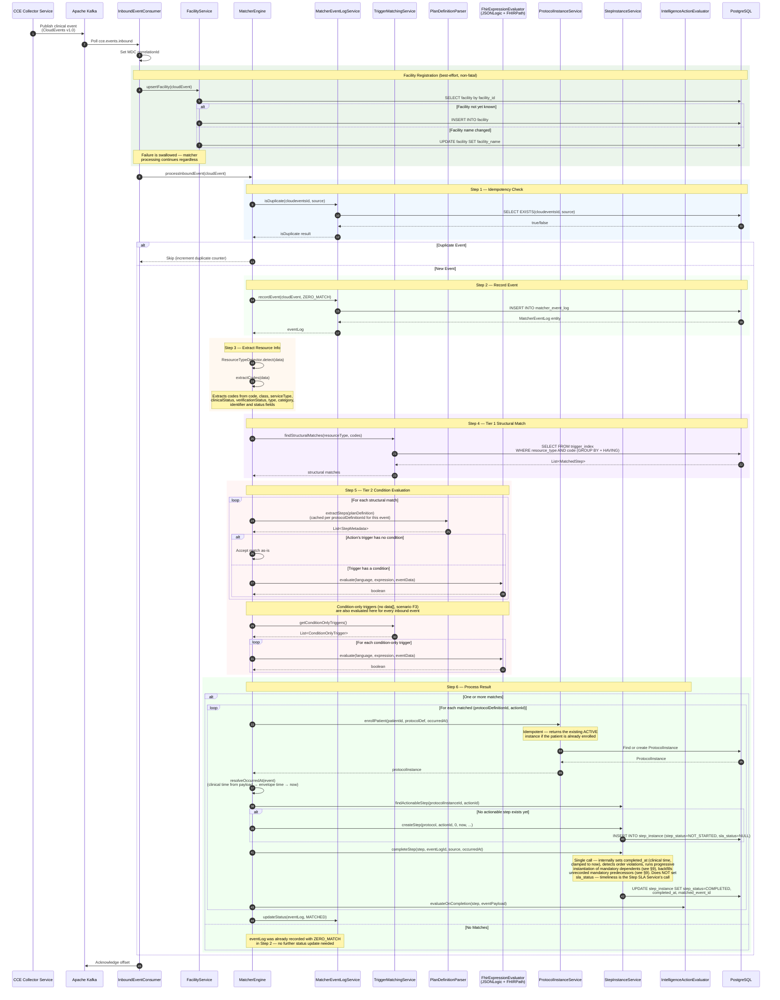

## 2. Protocol Read Model & Cache Reconciliation

Matcher does not load protocols. `protocol_definition`, `trigger_index` and `action_definition` are
written by the CCE Protocol Service; Matcher only reads them.

Tier 1 reads `trigger_index` per event, so it needs no warm-up. Condition-only triggers have no
`data[]` to index and live only in memory, so they are derived from the stored definitions — at startup
and then on a timer.

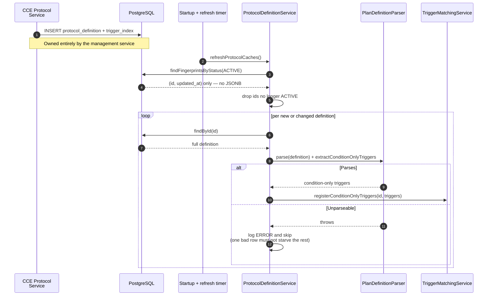

Because Matcher never writes these rows, it has no local mutation to invalidate on — so the same
reconciliation runs on a timer (`cce.protocol.refresh-interval-ms`, default 60s), converging all three
cases within one interval:

| Change by the management service | Tier 1 (`trigger_index`) | Condition-only + parsed caches |
|---|---|---|
| Protocol published | Immediate (read per event) | Registered on next refresh |
| Protocol retired / deleted | Immediate (rows gone) | Dropped on next refresh |
| Definition modified in place | Immediate | Re-derived on next refresh, detected via `updated_at` |

A refresh that finds nothing changed reads only `(id, updated_at)` — a definition's JSONB is fetched and
re-parsed only when its stamp moves or its id is new. Each instance polls independently; the caches are
per-process, so no leasing is needed.

> **Note:** in-place modification is detected through `updated_at`, so a writer that edits `definition`
> without advancing that column will not be picked up. Publishing and retiring are detected regardless,
> since those change which ids are `ACTIVE`.
>
> **Possible refinement:** a `protocol.published` Kafka event would cut the window from one interval to
> near-zero. It would supplement this sweep rather than replace it — an event that is missed while a
> consumer is down would otherwise leave the cache stale indefinitely, so the periodic reconciliation
> stays as the backstop.

## 3. Time-Driven SLA Transitions (owned elsewhere)

Matcher schedules these but does not apply them. When it creates a step it writes one
`step_sla_state_transition` row per threshold; the CCE Step SLA Service claims a row once its deadline
has passed — or as soon as the step completes, since `completed_at` then decides the outcome on its own —
applies the `sla_status` change, and records the `OVERDUE` / `MISSED` deviation. There is no Kafka hop —
the two services meet on the table, with one writer per column. See
[Architecture Overview §1.1](architecture-overview.md#11-sla-transition-evaluation-contract).

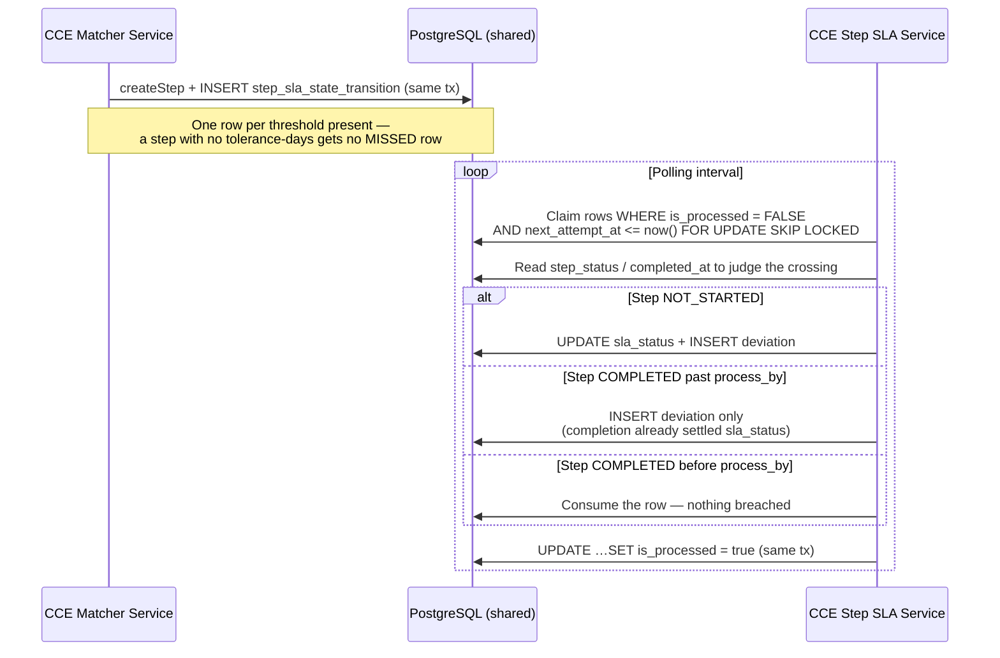

## 4. Protocol Enrollment Flow

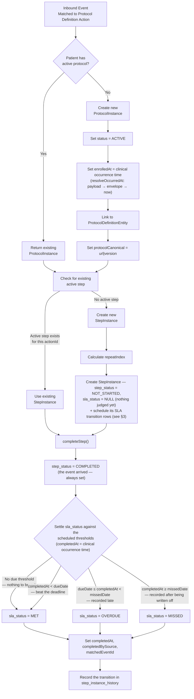

**The two statuses are independent.** `step_status` answers *did the work happen?* and is always
`COMPLETED` here. `sla_status` answers *was it on time?* and is one of the three outcomes above — so a
row can legitimately read `COMPLETED` + `MISSED`, meaning the work was done but only after the step had
been written off.

> There is no `EARLY` or `ON_TIME` status. The 1.x schema had a separate `completion_status` column with
> `EARLY`/`ON_TIME`/`LATE`; `V2` drops it, because the pair above already expresses it —
> `COMPLETED`+`MET` is on time, `COMPLETED`+`OVERDUE`/`MISSED` is late. See
> [`SlaStatus`](../../cce-common-util/docs/data-dictionary.md#slastatus) for the full value reference.

## 5. Deviation Detection & Recording

Matcher records exactly one deviation type: `ORDER_VIOLATION`, detected on completion. The time-driven
`OVERDUE` and `MISSED` deviations are recorded by the CCE Step SLA Service (§3), which also owns
intelligence evaluation for them.

> **Intelligence action evaluation** is triggered after the deviation is recorded, and only when it was
> newly inserted. See §6 for the full intelligence pipeline flow.

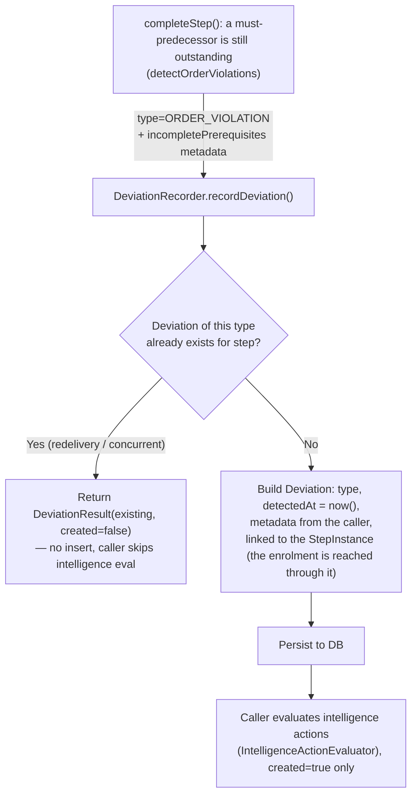

## 6. Intelligence Action Evaluation & Trigger Publishing

This flow is triggered after an `ORDER_VIOLATION` is detected or after a step is completed. (`OVERDUE`/`MISSED` deviations are raised by the CCE Step SLA Service, which owns intelligence evaluation for them.) The `IntelligenceActionEvaluator` evaluates PlanDefinition intelligence action conditions and publishes intelligence events.

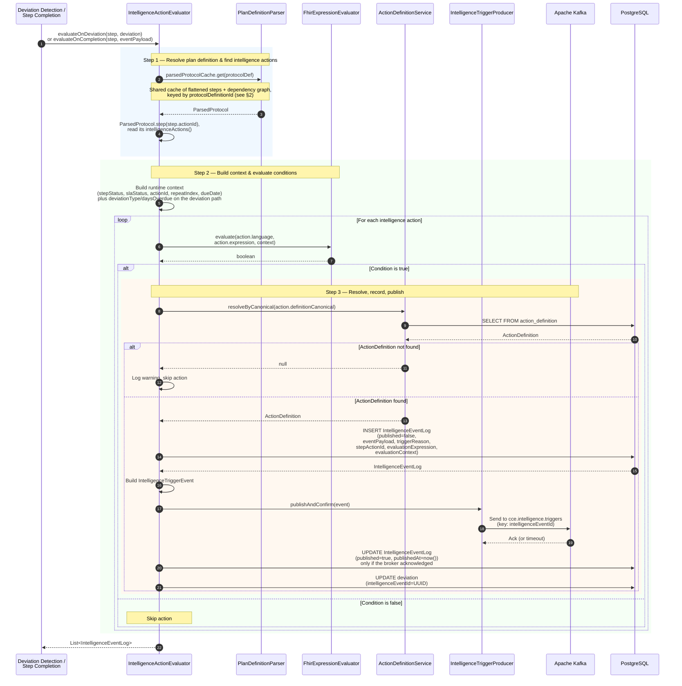

### Intelligence Event Content Assembly

`IntelligenceTriggerEvent` is a flat domain message — every field below is a real field on it. The
richer per-execution context (deviation id, evaluation expression, evaluated context) is written to
`intelligence_event_log`, not onto the event.

```mermaid
flowchart TD
    subgraph "Input Sources"
        STEP["StepInstance<br/>(stepStatus, slaStatus, actionId)"]
        PI["ProtocolInstance<br/>(patientId, protocolCanonical, protocolDefinitionId)"]
        RULE["IntelligenceActionInfo<br/>(severity, intelligenceDestination)"]
        ACTDEF["ActionDefinition<br/>(id, actionType)"]
        EVT["Inbound CloudEvent<br/>(data)"]
        LOG["IntelligenceEventLog<br/>(id, assigned on insert)"]
    end

    subgraph "IntelligenceTriggerEvent"
        E_ID["id: UUID (new)"]
        E_IEID["intelligenceEventId"]
        E_SUBJECT["subject: patientId"]
        E_ADID["actionDefinitionId"]
        E_PDID["protocolDefinitionId"]
        E_AT["actionType"]
        E_SEV["severity"]
        E_DEST["intelligenceDestination"]
        E_STS["stepStatus"]
        E_SS["slaStatus"]
        E_AID["actionId"]
        E_PC["protocolCanonical"]
        E_DAT["detectedAt"]
        E_PAY["eventPayload"]
    end

    STEP --> E_STS
    STEP --> E_SS
    STEP --> E_AID
    PI --> E_SUBJECT
    PI --> E_PC
    PI --> E_PDID
    RULE --> E_SEV
    RULE --> E_DEST
    ACTDEF --> E_ADID
    ACTDEF --> E_AT
    EVT --> E_PAY
    LOG --> E_IEID
```

> `intelligenceEventId` is the `intelligence_event_log` row id, filled in after the row is inserted and
> used for cross-service correlation. It is also the Kafka message key.

## 7. Kafka Consumer Error Handling

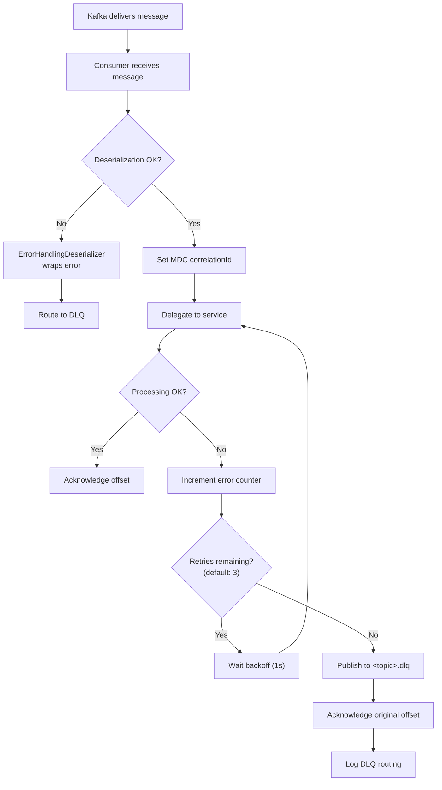

## 8. Flat Sub-Step Processing

All steps (including those originally nested in `action.action[]`) are treated as peers. Nested step-type actions are flattened at parse time with `relatedSteps` linking them to their parent. No separate sub-step routing is needed — the standard matching and completion flow handles them uniformly.

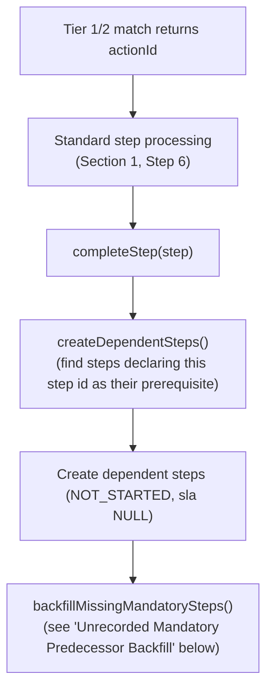

### Dependent Step Creation on Completion

`relatedAction` is a **relative** pointer — a step states how it sits against another, from either end (`after-*` or `before-*`) — so the forward direction needed here comes from the normalized graph built by `PlanDefinitionParser.buildDependencyGraph()`. When any step completes, `createDependentSteps()` looks up the steps that depend on it and creates them with due dates taken from the offset on the edge between them.

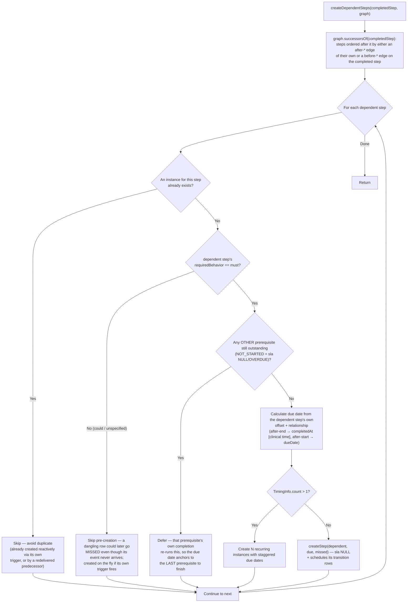

### Unrecorded Mandatory Predecessor Backfill (backfillMissingMandatorySteps)

Progressive instantiation only works *forward*, so a step created reactively from its own trigger leaves the mandatory steps that should have preceded it with no `step_instance` row — invisible both in the journey view ("not started") and to the SLA evaluator, having no scheduled transition. After every completion, mandatory predecessors of the observed progress that have no row are materialized as `NOT_STARTED` with no SLA judgement. See `architecture-overview.md` §6.1 for the full rationale.

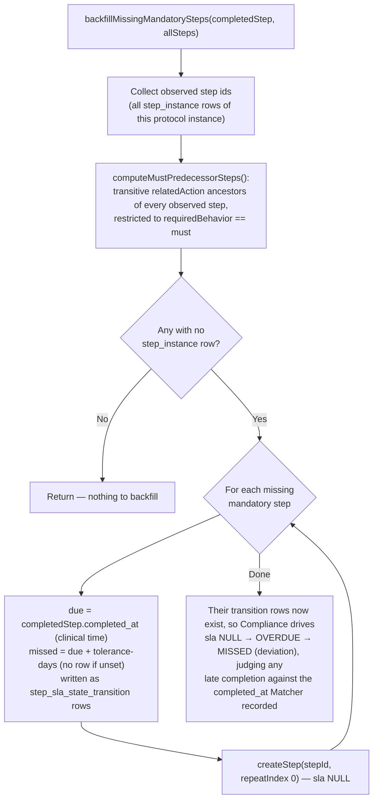

> Steps still **ahead** in the chain are deliberately excluded — backfilling them would stamp them with this completion's time and flatten the schedule their own `relatedAction` offsets define. They are left to progressive instantiation.

> **Protocol completion:** there is currently no code path that transitions a `ProtocolInstance` out of `ACTIVE`. The automatic completion check and its supporting graph helpers were removed pending finalized completion criteria — see [Architecture Overview §6.2](architecture-overview.md#62-protocol-instance).
